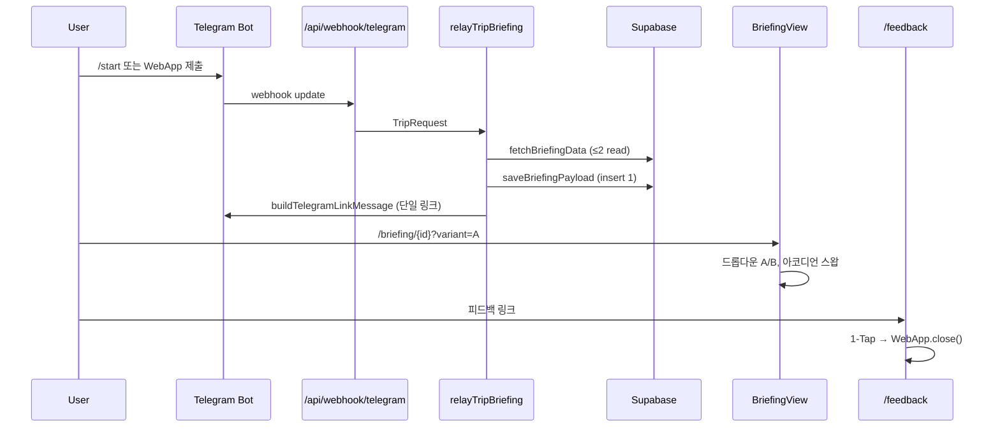

# Project Eliot — 시스템 아키텍처 (2026-06-18 스냅샷)

> **감사 기준일**: 2026-06-18 · **실측**: `lib/engine/` `fetch`/`await` 0건 · `npm run build` 성공 · `vitest` 21 suites / 233 tests 통과

## 1. 목표와 설계 철학

Eliot은 가족 당일 여정의 **의사결정 노동을 0에 수렴**시키는 Telegram 기반 여행 브리핑 시스템이다.

| 철학 | 코드에서의 구현 |
|------|----------------|
| **Zero-Noise** | 화면·메시지에 동시에 노출되는 선택지·버튼 수를 최소화. 비교·교체는 **의도적 조작(progressive disclosure)** 으로만 드러난다. |
| **Frictionless** | 진입은 1-Tap(딸깍)에 가깝게: Telegram WebApp 폼 제출 → 단일 브리핑 링크 → 피드백은 만족/불만 1탭 후 즉시 종료. |
| **Deterministic Engine** | `lib/engine/`은 동일 입력 → 동일 출력. 런타임 외부 API·`await` 0건 (`__tests__/engine-purity.test.ts` 영구 가드). |
| **IO 경계 분리** | DB·Telegram·CloudStorage는 `lib/supabase/`, `lib/webhook/`, `lib/webapp/`에만 존재. 엔진은 `Place[]`·`AppConfig` 등 순수 데이터만 소비. |

---

## 2. 기술 스택

| 계층 | 기술 |
|------|------|
| 프레임워크 | Next.js 16.2.9 (App Router), React 19.2.4 |
| 스타일 | Tailwind CSS 4, `components/ui/` 공통 프리미티브 |
| Telegram | `@twa-dev/sdk` — WebApp 폼·피드백 Fast-Close |
| DB | Supabase (`places`, `briefings`, `feedback_events`, `app_config`) |
| 검증·테스트 | Zod, Vitest |

---

## 3. 디렉터리 구조 (런타임 관점)

```
app/
  page.tsx                 → redirect("/webapp")
  webapp/                  → Telegram TMA 여정 입력 폼 (WebAppForm)
  briefing/[id]/           → 서버 read + BriefingView (클라이언트)
  feedback/                → 1-Tap Fast-Close 피드백
  api/
    webhook/telegram/      → /start 키보드 + web_app_data → 브리핑 전달
    journey/submit/        → (대체 제출 경로)
    course/swap/           → 블록 단위 장소 교체
    feedback/              → 피드백 insert

lib/
  engine/                  → 순수 코스 생성·브리핑·스왑 (IO 금지)
  webhook/                 → Telegram 메시지·URL 조립·웹훅 파싱
  journey/                 → relayTripBriefing / deliverTripBriefing 오케스트레이션
  supabase/                → fetchBriefingData, briefing-store (id-row)
  webapp/                  → TMA 상태·제출·course-state-storage
  feedback/                → 피드백 URL·검증
  config/                  → mood tags, app-config (Zod)
  admin/                   → DashboardView (사령관 전용)

components/ui/
  Button.tsx, Card.tsx, cn.ts   → BriefingView·WebAppForm·feedback 공유
```

**CMS·시드**(런타임 비포함): `scripts/sync-sheets.ts`, `scripts/ingest-spots.ts` — Google Sheets → Supabase 단방향. 상세는 `docs/cms-architecture.md`.

---

## 4. 사용자 여정 (코드 추적)



1. **진입**: `app/webapp/WebAppForm.tsx` — mood·duration·mode 입력 후 `web_app_data`로 webhook 전송.
2. **브리핑 생성**: `lib/journey/relay-briefing.ts` → `fetchBriefingData()` → `buildBriefingLinks()` → A/B dual payload를 `briefings` 테이블 **1행**에 저장, 짧은 id URL 반환.
3. **Telegram 전달**: `lib/webhook/telegram-message.ts` — **urlA 단일 링크** + `COURSE_COMPARE_HINT` + 피드백 링크. (urlB는 내부 생성·테스트용, 메시지에는 미노출)
4. **브리핑 소비**: `app/briefing/[id]/page.tsx`(RSC)가 `loadBriefingPayload(id)` 1회 → `BriefingView`에 props 전달. 클라이언트 추가 fetch 없음.
5. **스왑**: 사용자가 블록 카드 탭 → 아코디언 확장 → `fetch("/api/course/swap")` (UI 트리거 시에만).
6. **피드백**: `app/feedback/page.tsx` — 큰 만족/불만 버튼, 불만 시에만 textarea progressive disclosure, 제출 후 0.5초 플래시 → `Telegram.WebApp.close()`.

---

## 5. 브리핑 전달: id-row 모델 (part B)

| 이전 (폐기) | 현재 |
|-------------|------|
| URL hash `#data=` + lz-string dual 중복 | `/briefing/{id}?variant=A\|B` |
| Telegram 4,326자 한도 초과 | ~62자 고정 URL + 메시지 ~724자 |
| 클라이언트 hash 파싱 | 서버 `loadBriefingPayload` 1회 |

- **저장**: `lib/supabase/briefing-store.ts` — base62 12자 id, `payload jsonb`, 7일 TTL.
- **URL 생성**: `lib/webhook/briefing-urls.ts` — `buildBriefingUrl()`에 TMA 캐시 파기용 `&_ts=${Date.now()}` 부착.
- **해석**: `resolveBriefingPayload()` — dual이면 A/B 브리핑·라벨을 한꺼번에 props로 전달.

---

## 6. Zero-Noise UX — 현재 구현

### 6.1 Telegram 메시지 (`lib/webhook/telegram-message.ts`)

- A/B 분리 인라인 링크 **제거**.
- 본문: (선택) 요약 `<pre>` → `💡 웹뷰에서 두 가지 코스 옵션을 비교할 수 있습니다.` → `🔗 여정 브리핑 확인하기`(urlA) → 피드백 링크.
- **원칙**: 메시징 채널은 **단일 진입점**; A/B 비교는 페이로드를 이미 갖춘 웹뷰에 위임.

### 6.2 BriefingView (`app/briefing/[id]/BriefingView.tsx`)

| UI 요소 | 구현 |
|---------|------|
| A/B 선택 | 상단 **컴팩트 드롭다운** (`variantMenuOpen`). `history.replaceState`로 `?variant=` 동기화. |
| 스왑 | 기본 **숨김**. 블록 `<li>` 클릭 시 `expandedBlockKey` 아코디언 → `grid-rows-[0fr]`→`[1fr]`로 "다른 곳으로" 노출. |
| 밀도 | `text-[10px]`·`h-dvh`·`overflow-hidden` — 모바일 세로 화면에서 스크롤·버튼 점유 최소화. |
| 상태 국소화 | `activeVariant`, `activeBriefing`, `expandedBlockKey` 등 **뷰 로컬 `useState`**. CloudStorage 동기화는 `writeCourseState`만 유지(기존 계약). |

`dual` prop이 없으면(단일 variant) 헤더 배지로 variant만 표시.

### 6.3 공통 UI (`components/ui/`)

- `Button` / `Card` — `BriefingView`, `WebAppForm`, `feedback/page.tsx`가 동일 시각 언어 공유.
- `tone="telegram"` — TMA CSS 변수(`--tg-button-color` 등) 연동.

---

## 7. Frictionless UX — 현재 구현

| 화면 | 패턴 |
|------|------|
| WebAppForm | 최소 필드, Telegram 테마 자동 적용 (`apply-telegram-theme`) |
| BriefingView | 서버에서 데이터 완결 → 로딩 스피너·2차 fetch 없음 |
| Feedback | `sentiment` 1탭 → (불만 시만) 사유·메모 → 제출 → `showSuccessFlash` 0.5초 → `closeTelegramWebApp()` |
| 하단 nav | `feedbackUrl` 있을 때만 "피드백 남기기" 노출 |

---

## 8. 엔진 레이어 (`lib/engine/`)

**핵심 모듈**

| 파일 | 역할 |
|------|------|
| `course-generator.ts` | 블록별 장소 선택, region tier 게이트, weather exclusion DSL |
| `generate-briefing.ts` | TripRequest → Briefing |
| `region-tiers.ts` | ICN_METRO / CAPITAL_EXT / EXCLUDED (정적 JSON) |
| `phase-schedule.ts` | clock-time 윈도우, 일몰 야외 제외 |
| `swap-spot.ts` / `apply-course-swap.ts` | 결정적 스왑 |
| `variant.ts` | A/B 라벨·B 변형 derive |

**불변식 (2026-06-18 실측)**

- `grep` `fetch\(|await ` in `lib/engine/` → **0건**
- `engine-purity.test.ts` → 매 CI 실행 시 fs 스캔으로 동일 검증
- `resolvePriorFeedback()` → `lib/webapp/feedback-storage.ts`로 이전 완료 (엔진 경계 정리)

**day-trip 엔진 freeze**: T2~T5(region gate, weather, clock-time, checklist) 완료 후 동결. UX 세션은 엔진 미변경.

---

## 9. API 라우트 요약

| Route | 메서드 | 역할 |
|-------|--------|------|
| `/api/webhook/telegram` | POST | secret 검증, /start, web_app_data → `deliverTripBriefing` |
| `/api/course/swap` | POST | `StoredCourseState` + block index → 스왑된 Briefing |
| `/api/feedback` | POST | `feedback_events` insert 1건 |
| `/api/journey/submit` | POST | 대체 제출 (relay 경로) |

**런타임 DB read 예산**: 트립 생성 시 `fetchBriefingData` 2회 + `saveBriefingPayload` 1 write. 브리핑 페이지는 `loadBriefingPayload` 1 read.

---

## 10. 환경·배포

- `APP_BASE_URL` (https 필수) — 브리핑·피드백 URL 베이스
- `TELEGRAM_BOT_TOKEN`, webhook `secret_token`
- Supabase: `NEXT_PUBLIC_SUPABASE_URL`, `NEXT_PUBLIC_SUPABASE_ANON_KEY`
- 프로덕션: Vercel (`eliot-murex.vercel.app`), `main` 브랜치 자동 배포

---

## 11. 관련 문서

| 문서 | 내용 |
|------|------|
| `docs/decisions.md` | R&D-ADR 누적 (의사결정 이력) |
| `docs/prompts.md` | 고효율 AI 프롬프트 아카이브 |
| `docs/cms-architecture.md` | Sheets → Supabase CMS |
| `docs/2026-06-18 연구개발일지 part *.md` | 당일 세션 상세 일지 |
