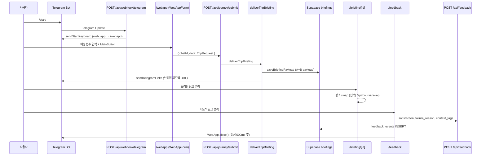

# Eliot 시스템 현황 보고서

코드베이스 스캔 결과를 근거로 작성했습니다. 저장소 내에 존재하지 않는 설정·파이프라인은 “코드에 없음”으로 명시합니다.

---

## 1. 프론트엔드 및 UI/UX 아키텍처 현황

### 1.1 기술 스택

| 항목 | 코드 근거 |
|------|-----------|
| 프레임워크 | Next.js `16.2.9`, React `19.2.4` (`package.json` L27–32) |
| 스타일 | Tailwind CSS `^4`, `@tailwindcss/postcss` (`package.json` L36, `app/globals.css` L1) |
| Telegram TMA | `@twa-dev/sdk` `^8.0.2` — `WebAppForm.tsx` L66에서 dynamic import |
| 검증 | `zod` `^3.25.76` — `lib/config/app-config.ts` |
| DB 클라이언트 | `@supabase/supabase-js` `^2.108.1` |
| 테스트 | Vitest (`vitest.config.ts`, `package.json` L10–11) |

폰트는 `app/layout.tsx` L5–13에서 Geist / Geist Mono(`next/font/google`)를 로드합니다. 루트 `metadata`는 아직 create-next-app 기본값(`title: "Create Next App"`)입니다 (`app/layout.tsx` L15–18).

### 1.2 라우트 구조

`app/` 디렉터리 실측 결과:

| 경로 | 파일 | 렌더링 방식 |
|------|------|-------------|
| `/` | `app/page.tsx` | Server — `redirect("/webapp")` (L3–4) |
| `/webapp` | `app/webapp/page.tsx` → `WebAppForm.tsx` | Client (`"use client"`) |
| `/briefing/[id]` | `app/briefing/[id]/page.tsx` → `BriefingView.tsx` | Server(데이터 로드) + Client(인터랙션) |
| `/feedback` | `app/feedback/page.tsx` | Client + `Suspense` |
| API | `app/api/**/route.ts` 6개 | Route Handler |

`export const runtime` / `dynamic` / `revalidate` 선언은 코드베이스 전체에서 **0건**입니다. Edge Runtime 지정도 없습니다.

### 1.3 상태 관리 구조

전역 상태 라이브러리(Redux, Zustand, Jotai 등)는 **의존성에 없고**, `useState`/`useEffect`만 사용됩니다.

| 컴포넌트 | 로컬 상태 용도 | 근거 |
|----------|----------------|------|
| `WebAppForm.tsx` | 폼 필드, Telegram 감지, 제출 상태 | L53–58 |
| `BriefingView.tsx` | variant, swap, 확장 블록, admin 대시보드 | L107–113 |
| `feedback/page.tsx` | sentiment, failure_reason, 제출 상태 | L50–63 |

**클라이언트 영속 저장소** (Telegram CloudStorage):

- `eliott_feedback_log` — `lib/webapp/feedback-storage.ts` L9
- `eliott_course_state` — `lib/webapp/course-state-storage.ts` L8
- `last_trip_feedback` (레거시) — `lib/webapp/telegram-native.ts` L4

`createBrowserSupabaseClient()`(`lib/supabase/client.ts`)는 정의만 있고, 다른 `.ts`/`.tsx`에서 import하는 코드는 **없습니다**.

### 1.4 UI 컴포넌트 설계

공유 UI는 `components/ui/` 3파일:

- `Button.tsx` — variant(`primary`/`secondary`/`ghost`/`tab`), tone(`default`/`telegram`), `href` 시 `<a>` 렌더
- `Card.tsx` — tone(`default`/`warning`/`telegram`), padding(`sm`/`md`)
- `cn.ts` — className 병합

**두 가지 시각 톤:**

1. **Telegram TMA 톤** (`tone="telegram"`) — WebApp·피드백  
   - CSS 변수 `--tg-*` (`app/globals.css` L8–16)  
   - `applyTelegramTheme()`이 Telegram `themeParams`를 DOM에 주입 (`lib/webapp/apply-telegram-theme.ts` L33–41)

2. **브리핑 뷰 톤** (`tone="default"`) — `bg-slate-50`, `text-[10px]`/`text-xs` 초소형 타이포  
   - `BriefingView.tsx` L224, L277–285, L351–353

### 1.5 “Frictionless / Zero-Noise” 철학의 코드 반영

**애플리케이션 코드(`.ts`/`.tsx`)에는 “Frictionless” 또는 “Zero-Noise” 문자열이 없습니다.**  
`docs/r&d-log.md` L7–17에만 “16필드 → 7필드 Zero-Noise”가 문서화되어 있습니다.

코드에서 확인되는 **동일 방향의 구현**은 다음과 같습니다.

| 원칙 (문서) | 코드 반영 |
|-------------|-----------|
| 7필드 장소 스키마 | `supabase/migrations/20260612_places.sql` L3–13 — `id, destination, name, category, is_outdoor, no_kids_zone, tags` (+ 파생 `stroller_friendly`, `has_nursing_room`) |
| WebApp 입력 최소화 | `build-trip-request.ts` — 고정 조건(`FIXED_OPERATION_TIME_LABEL`, `FIXED_BASE_CAMP`)과 “오늘의 변수” 분리 (`WebAppForm.tsx` L200–327) |
| mood_tags 수동 입력 없음 | `buildTripRequest()`가 `mood_tags: []` 전송 (`build-trip-request.ts` L52), `normalize()`가 `mood_intensity`로 태그 유도 (`normalize.ts` L40–55, L75–81) |
| 브리핑 URL 단축 | URL-hash 폐기 → `briefings` 테이블 id-row (`briefing-store.ts` L1–9, `20260618_briefings.sql`) |

### 1.6 최근 리팩토링된 뷰 렌더링 방식

**`BriefingView.tsx`** (`app/briefing/[id]/BriefingView.tsx`):

- 서버: `page.tsx`가 `loadBriefingPayload(id)` → `resolveBriefingPayload()` 후 props 전달 (L16–42)
- 클라이언트: `h-dvh max-h-dvh overflow-hidden` 고정 뷰포트 (L224)
- A/B 듀얼 variant: 드롭다운으로 전환, `window.history.replaceState`로 `?variant=` 갱신 (L226–271, L140–142)
- 블록: 클릭 시 `grid-rows-[0fr]`/`[1fr]` 애니메이션으로 “다른 곳으로” swap 버튼 노출 (L369–388)
- swap: `POST /api/course/swap` + CloudStorage 상태 (`handleSwapSpot` L153–217)
- 하단 nav: `feedbackUrl` 있을 때만 “여정 종료 후 피드백 남기기” (`showNav` L221, L441–444)

**`WebAppForm.tsx`**:

- Telegram `MainButton` “여정 생성” (L156–175)
- 비-Telegram 환경: 콘솔 로그 + “전송됨 (콘솔 확인)” (L134–137, L342–345)
- 뷰포트 보정: `correctTelegramViewportOnBlur`, `forceTelegramExpand` (`telegram-viewport.ts`)

---

## 2. 사용자 경험(UX) 및 유저 여정(User Journey)

### 2.1 전체 플로우 (코드 추적)



### 2.2 단계별 상세

#### 단계 0 — 진입: Telegram `/start`

- `parseStartUpdate()` — `text === "/start"` 이고 `web_app_data` 없을 때 (`parse-telegram.ts` L48–62)
- `APP_BASE_URL`이 `https://`로 시작해야 함, 아니면 400 (`webhook/telegram/route.ts` L36–49)
- `sendStartKeyboard()` — 메시지 + `web_app: { url: ${appBaseUrl}/webapp }` (`send-start-keyboard.ts` L1–9, L21)

#### 단계 1 — WebApp 폼 (`/webapp`)

**고정 조건** (`build-trip-request.ts`):

```8:11:c:\Eliot\lib\webapp\build-trip-request.ts
export const FIXED_OPERATION_TIME_LABEL = "출발 ~ 귀환 (총 5시간)";
export const FIXED_BASE_CAMP = "인천 연수구 랜드마크로 20 호반써밋 송도";
export const FIXED_DESTINATION = "인천_근교";
export const FIXED_DURATION_HOURS = 5;
```

**사용자 입력 → `TripRequest` 매핑** (`buildTripRequest` L45–72):

| UI 필드 | TripRequest 필드 |
|---------|------------------|
| 여행 기간 select | `trip_days` (1/2/3) |
| 날씨 text | `weather` |
| 에너지 슬라이더 | `mood_intensity` (0–100) |
| 일몰 time | `sunset_time` |
| 제약 textarea | `constraints` |
| 위치 버튼 | `location`, `destination` (좌표→`resolveDestinationFromCoords`) |
| (자동) Telegram message date | `trip_date` (`WebAppForm.tsx` L34–45) |

공통 고정값: `start_mode: "duration"`, `duration_hours: 5`, `origin`/`return_location`: 베이스캠프, `mode: "family"`, `mood_tags: []`.

**유효성**: `weather`, `sunset_time`, `constraints` 비어 있으면 제출 불가 (`isWebAppFormValid` L34–42). `destination`은 필수 아님.

#### 단계 2 — 제출 (`submitTripRequest`)

1. `initData` 없으면 alert 후 중단 (`submit-trip-request.ts` L74–78)
2. `resolvePriorFeedback()` — CloudStorage 이전 피드백 병합 (L31–57)
3. `POST /api/journey/submit` body:

```json
{
  "chatId": "<initDataUnsafe.user.id>",
  "data": "<enriched TripRequest>"
}
```

(`submit-trip-request.ts` L83–89)

4. 성공 시 `saveFeedback()` + `webApp.close()` (L94–98)
5. 제출 전 `maintainFeedbackStorage()` — 900건 이상이면 `/api/feedback/archive` 호출 (`feedback-storage.ts` L149–162)

#### 단계 3 — 서버 브리핑 생성 (`deliverTripBriefing`)

`lib/journey/relay-briefing.ts` 체인:

1. `fetchBriefingData()` — `places` SELECT + `get_briefing_metadata` RPC (`fetch-briefing-data.ts` L49–51)
2. Supabase 실패/3초 타임아웃 시 fixture 폴백 (`FETCH_TIMEOUT_MS = 3_000`, L9, L103–114)
3. `randomUUID()` → `tripId` (L78)
4. `normalize(tripRequest)` → A/B variant 생성 (`briefing-urls.ts` L163–177, `deriveVariantB`)
5. `saveBriefingPayload()` → `briefings` INSERT, id 반환 (L190)
6. URL 생성: `/briefing/{id}?variant=A|B&_ts={timestamp}` (`briefing-urls.ts` L129–136)
7. `buildFeedbackUrl(createFeedbackLinkParams(...))` (`relay-briefing.ts` L80–82)
8. `sendTelegramLinks(chatId, ...)` — Telegram HTML 메시지 (`send-telegram-links.ts`)

Telegram 메시지 구성 (`telegram-message.ts` L37–44):

- (선택) `<pre>` 브리핑 요약
- “웹뷰에서 두 가지 코스 옵션을 비교” 힌트
- `<a href="urlA">여정 브리핑 확인하기</a>` — **urlB는 메시지에 미포함**
- `<a href="feedbackUrl">여정 종료 후 피드백 남기기</a>`

`chatId` 해석: 요청 body → `TELEGRAM_CHAT_ID` env (`parse-submit-body.ts` L21–23, `relay-briefing.ts` L115–116).

#### 단계 4 — 브리핑 뷰 (`/briefing/[id]`)

**Query params**: `variant` (`A`|`B`, 기본 `A`) — `page.tsx` L13–14

**데이터 로드**: `loadBriefingPayload(id)` — `expires_at > now()` 조건 (`briefing-store.ts` L57–61). 없으면 만료/오류 메시지 (`page.tsx` L23–30).

**화면 전환**:

- 듀얼 payload 시 variant 드롭다운 (`BriefingView.tsx` L226–271)
- 블록 탭 → 확장 → “다른 곳으로” → swap API
- 하단 “여정 종료 후 피드백 남기기” → `feedbackUrl` (href 링크)

**CloudStorage 동기화**: briefing 변경 시 `writeCourseState()` (`BriefingView.tsx` L147–151)

#### 단계 5 — 피드백 (`/feedback`)

**URL params** (`lib/feedback/context.ts`):

| Param | 용도 |
|-------|------|
| `trip_id` | 피드백 이벤트 연결 (없으면 `V0_TRIP_ID`) |
| `subject_id` | 기본 `"subin"` |
| `mode` | `family` \| `couple` |
| `return_location` | context_tags |
| `mood_tags` | 콤마 구분 |
| `mood_intensity` | 숫자 |
| `route_variant` | `A` \| `B` |

**UX 흐름** (`feedback/page.tsx`):

- “좋음” 탭 → 즉시 `satisfaction: 5`, `failure_reason: "none"` 제출 (L124–136)
- “아쉬움” 탭 → failure_reason 선택 + 선택적 note → `satisfaction: 2` (L139–168)
- 성공 시 500ms 후 `Telegram.WebApp.close()` (L117–121, L28–41)

**API payload** → `feedback_events` INSERT (`api/feedback/route.ts` L128–135)

#### 대체 경로: Webhook 직접 `web_app_data`

`POST /api/webhook/telegram`이 `web_app_data.data` JSON을 `TripRequest`로 파싱하는 경로도 존재 (`parse-telegram.ts` L65–85). 현재 WebApp은 `/api/journey/submit`을 사용하므로, 이 경로는 레거시/대체 수신 경로로 코드에 남아 있습니다.

---

## 3. 인프라 및 백엔드 통합 현황

### 3.1 GitHub ↔ Vercel 파이프라인

**코드베이스 내 확인 결과:**

| 항목 | 상태 |
|------|------|
| `.github/workflows/` | **없음** (glob 0건) |
| `vercel.json` | **없음** |
| CI/CD 스크립트 | **없음** |

Vercel 배포 URL의 **유일한 코드 근거**는 테스트 파일입니다:

```64:64:c:\Eliot\__tests__\webhook-route.test.ts
    process.env.APP_BASE_URL = "https://eliot-murex.vercel.app";
```

`README.md`는 create-next-app 기본 “Deploy on Vercel” 문구만 포함합니다 (L32–35). Git push → Vercel 자동 배포 연동은 **이 저장소 파일만으로는 확인 불가**합니다.

`RUN_seed_foundation.md` L29에는 “git push, Vercel 배포 → operator 수동”이라고 명시되어 있습니다.

### 3.2 Vercel 환경 렌더링 방식 (코드 기준)

| 대상 | 방식 | 근거 |
|------|------|------|
| `/briefing/[id]` | **SSR** (async Server Component) | `page.tsx` — `"use client"` 없음, `await loadBriefingPayload` |
| `/webapp`, `/feedback`, `BriefingView` | **CSR** | `"use client"` 선언 |
| API Routes | **Route Handler** (기본 Node 런타임) | `app/api/**/route.ts`, `runtime` 미지정 |
| Edge Function | **코드에 없음** | `export const runtime` 0건 |

`next.config.ts`는 빈 설정 객체입니다 (L3–5).

### 3.3 환경 변수 (코드에서 참조되는 항목)

#### 런타임 (프론트 + API)

| 변수 | 사용처 |
|------|--------|
| `NEXT_PUBLIC_SUPABASE_URL` | `lib/supabase/client.ts`, `server.ts` |
| `NEXT_PUBLIC_SUPABASE_ANON_KEY` | 동일 |
| `APP_BASE_URL` | webhook, briefing URL, feedback URL 생성 |
| `TELEGRAM_BOT_TOKEN` | `send-start-keyboard`, `send-telegram-links`, `send-error-message` |
| `TELEGRAM_CHAT_ID` | chatId fallback (`parse-submit-body`, `relay-briefing`, `parse-telegram`) |
| `TELEGRAM_WEBHOOK_SECRET` | webhook 인증 (`verify-webhook-secret.ts`) — 미설정 시 검증 스킵 (L5–9) |

`.env` / `.env.local` 파일은 저장소에 **없습니다** (glob 0건). `scripts/apply-remote-migration.ts` L16은 `.env.local`을 dotenv로 로드합니다.

#### 스크립트 전용 (런타임 API 미사용)

| 변수 | 사용처 |
|------|--------|
| `SUPABASE_SERVICE_ROLE_KEY` | `scripts/lib/place-sync.ts`, `apply-remote-migration.ts` 등 |
| `GOOGLE_SERVICE_ACCOUNT_KEY` / `GOOGLE_SHEETS_*` | `scripts/sync-sheets.ts`, `sync-diff.ts` |
| `SYNC_EXECUTE` | 시드/동기화 실행 가드 |
| `KAKAO_REST_API_KEY` | `archive/geocode-kakao-spots.ts` (아카이브) |

`briefing-store.ts` L8–9: 런타임은 **anon key만** 사용, service role은 scripts 전용.

### 3.4 Supabase 데이터 연동

#### 클라이언트 생성

```3:11:c:\Eliot\lib\supabase\server.ts
export function createServerSupabaseClient(): SupabaseClient | null {
  const url = process.env.NEXT_PUBLIC_SUPABASE_URL;
  const anonKey = process.env.NEXT_PUBLIC_SUPABASE_ANON_KEY;
  // ...
  return createClient(url, anonKey);
}
```

브라우저 직접 Supabase 호출은 **현재 미사용** (`createBrowserSupabaseClient` 0 import).

#### 테이블 및 RLS (마이그레이션 기준)

| 테이블 | 용도 | anon 정책 |
|--------|------|-----------|
| `places` | 장소 풀 | SELECT (`20260612_places.sql` L34–38) |
| `app_config` | 엔진 설정 KV | SELECT (`20260612_app_config.sql` L13–17) |
| `feedback_events` | 피드백 이벤트 | SELECT + INSERT (`20260612_feedback_events.sql` L23–34) |
| `briefings` | 브리핑 payload (7일 TTL) | SELECT + INSERT (`20260618_briefings.sql` L19–31) |
| `destinations` | (`20260613_destinations.sql` — 별도 마이그레이션) |

#### RPC

`get_briefing_metadata()` — `feedback_events` + `app_config`를 JSONB로 반환 (`20260617_briefing_metadata_rpc.sql`). `anon`에 EXECUTE 권한 (L32).

#### 런타임 DB 접근 패턴

| 작업 | 호출 | DB 연산 |
|------|------|---------|
| 브리핑 생성 | `fetchBriefingData()` | `places` SELECT + RPC 1회 |
| 브리핑 저장 | `saveBriefingPayload()` | `briefings` INSERT 1건 |
| 브리핑 로드 | `loadBriefingPayload()` | `briefings` SELECT 1건 (만료 필터) |
| 피드백 제출 | `POST /api/feedback` | `feedback_events` INSERT |
| 장소 swap | `deliverCourseSwap()` | `fetchBriefingData()` 재호출 |

`fetchBriefingData` 실패 시 `getFixtureBriefingData()` 폴백, `source: "fixture"` (`fetch-briefing-data.ts` L103–114).

#### 인증 구조

- **Supabase Auth**: 코드에 사용자 로그인/세션 처리 **없음**
- **Telegram Webhook**: `x-telegram-bot-api-secret-token` 헤더 검증 (`verify-webhook-secret.ts`)
- **Admin**: `COMMANDER_TELEGRAM_ID = 123456789` 하드코딩 (`BriefingView.tsx` L51) + `initDataUnsafe.user.id` 비교 (`is-admin.ts`)
- **TMA 제출**: `initData` 필수 (`submit-trip-request.ts` L74–78)

### 3.5 CMS / 데이터 파이프라인 (런타임 외부)

Google Sheets → Supabase 동기화는 **스크립트**로만 존재:

- `pnpm cms:sync` → `scripts/sync-sheets.ts`
- `pnpm ingest` → `scripts/ingest-spots.ts`

`lib/engine/`에는 `fetch`/`await` 외부 API 호출이 없다는 불변식이 `RUN_codebase_leaning.md` L60에 문서화되어 있으며, 엔진 디렉터리는 `Place[]` + `AppConfig` + `FeedbackEvent[]` 입력만 받습니다 (`docs/r&d-log.md` L28).

---

## 부록: 현재 코드에서 확인된 주요 제약·특이사항

1. **루트 `/`는 `/webapp`으로 리다이렉트** — Telegram 외 브라우저에서도 WebApp 폼 접근 가능 (`app/page.tsx` L3–4).
2. **Telegram 메시지에 urlB 미포함** — A안 링크만 전송, B안은 브리핑 뷰 내 variant 전환으로 접근 (`telegram-message.ts` L37–41 vs `BriefingView` 듀얼 UI).
3. **`/api/feedback/archive`는 DB 저장 없음** — `console.warn` 로그만 (`archive/route.ts` L13–17).
4. **`app/api/course/generate/route.ts`는 존재하지 않음** — `docs/r&d-log.md` L44에 언급되나 현재 `app/api/course/`에는 `swap`만 있음.
5. **레이아웃 metadata·admin ID**는 프로덕션 미정비 상태로 보이는 placeholder 값이 코드에 남아 있음 (`layout.tsx` L15–17, `BriefingView.tsx` L51).

---

이 보고서는 저장소 내 `.ts`/`.tsx`/`.sql`/`.json` 및 `app/` 디렉터리 실측만을 근거로 작성했습니다. Vercel 대시보드 설정, Telegram Bot webhook 등록 상태, Supabase 프로젝트 실제 배포 여부는 이 코드베이스 범위 밖입니다.
