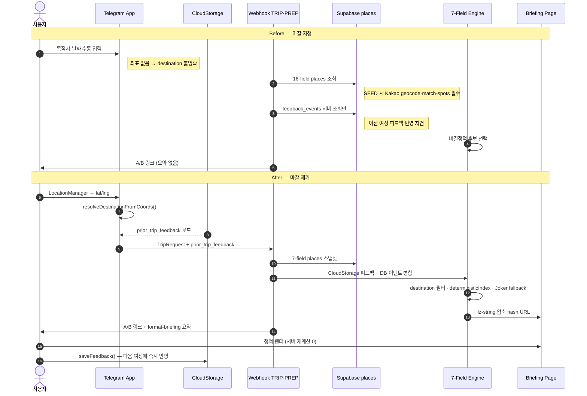
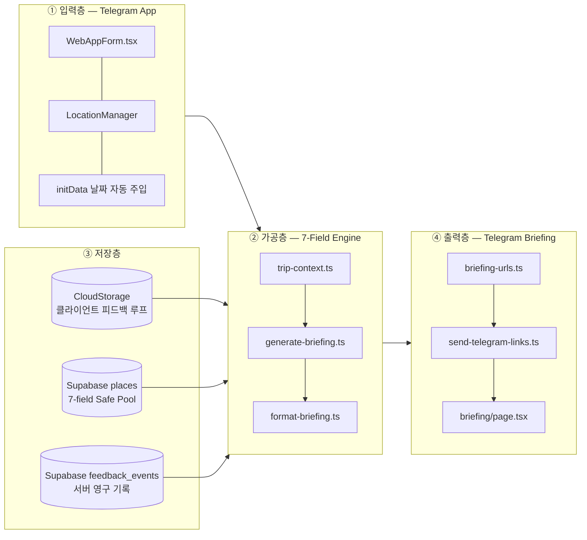

# ELIOT CMS Architecture — Google Sheets Headless CMS

## 개요

ELIOT의 마스터 데이터(Safe Pool 장소, 운영 설정)는 **Google Sheets**에서 관리한다.  
런타임(TRIP-PREP 웹훅, Engine, Web App)은 Supabase에 이미 동기화된 스냅샷만 읽으며, **Google API 호출은 SEED 단계 스크립트에서만** 수행한다.

```
┌─────────────────────┐     SEED only      ┌──────────────────────┐
│  Google Sheets      │ ─────────────────► │  scripts/sync-sheets │
│  (SSOT / Master)    │   googleapis       │  .ts                 │
└─────────────────────┘                    └──────────┬───────────┘
                                                      │ upsert
                                                      ▼
                                           ┌──────────────────────┐
                                           │  Supabase `places`   │
                                           │  (Runtime Snapshot)  │
                                           └──────────┬───────────┘
                                                      │ select *
                                                      ▼
┌─────────────────────┐                    ┌──────────────────────┐
│  Telegram Webhook   │ ◄── fetch only ──│  fetch-briefing-data │
│  Engine (pure fn)   │                    │  (Supabase client) │
└─────────────────────┘                    └──────────────────────┘
```

## 아키텍처 불변식 (Invariants)

| # | 규칙 | 근거 |
|---|------|------|
| 1 | **런타임 Google API 호출 0건** | 웹훅 응답 SLA·외부 의존성 격리 |
| 2 | **Sheets → DB 단방향** | Sheets가 SSOT, Supabase는 배포 스냅샷 |
| 3 | **Engine 순수 함수 유지** | `places: Place[]` 인자만 받음, IO 없음 |
| 4 | **웹훅은 Supabase만 조회** | `fetchBriefingData()` 경로 고정 |

## 스프레드시트 구조

### 시트 1: `places` (Safe Pool)

첫 행은 헤더. 데이터 행은 2행부터. `id`가 비어 있거나 `status=archived`인 행은 동기화에서 제외한다.

| 컬럼 (Sheet) | `places` 테이블 | TypeScript (`Place`) | 타입 | 필수 | 변환 규칙 |
|--------------|-----------------|----------------------|------|------|-----------|
| `id` | `id` | `id` | `text` | ✓ | 슬러그(`p001`) 또는 UUID. 슬러그는 `uuid v5`로 결정적 매핑 (`scripts/lib/place-sync.ts`) |
| `destination` | `destination` | `destination` | `text` | ✓ | 예: `인천_근교` |
| `name` | `name` | `name` | `text` | ✓ | 표시명 |
| `category` | `category` | `category` | `enum` | ✓ | `meal` \| `cafe` \| `activity` \| `view` \| `kids` |
| `is_outdoor` | `is_outdoor` | `is_outdoor` | `boolean` | ✓ | `TRUE`/`FALSE`, `1`/`0`, `예`/`아니오` |
| `no_kids_zone` | `no_kids_zone` | `no_kids_zone` | `boolean` | ✓ | 동일 |
| `tags` | `tags` | `tags` | `text[]` | | 쉼표 구분 태그. `classifyTags()`로 stroller/nursing 플래그 파생 |
| `status` | *(미저장)* | — | `enum` | | `active` \| `archived`. `archived` 행은 upsert 제외 |

#### Supabase `places` DDL (7-field Sheet 스키마)

```sql
create table public.places (
  id                uuid primary key,
  destination       text not null,
  name              text not null,
  category          text not null check (category in ('meal','cafe','activity','view','kids')),
  is_outdoor        boolean not null default false,
  no_kids_zone      boolean not null default false,
  tags              text[] not null default '{}',
  stroller_friendly boolean not null default false,
  has_nursing_room  boolean not null default false
);
```

Engine 계약 타입: `lib/engine/types.ts` → `Place`.

### 시트 2: `config` (운영 설정, P2 M2+)

M2 스캐폴딩 단계에서는 **문서화만** 수행한다. 런타임 설정(`lib/config/mood-tags.config.ts` 등)은 후속 마일스톤에서 Sheets 동기화 대상이 된다.

| 컬럼 | 설명 | 예시 |
|------|------|------|
| `key` | 설정 키 | `default_destination` |
| `value` | JSON 또는 스칼라 | `인천_근교` |
| `scope` | 적용 범위 | `global` \| `destination:인천_근교` |
| `updated_at` | 수정일 | `2026-06-12` |

## 동기화 파이프라인

### 1. 인증 (SEED 전용)

`.env.local`:

```env
GOOGLE_SERVICE_ACCOUNT_KEY={"type":"service_account",...}
GOOGLE_SHEETS_SPREADSHEET_ID=<spreadsheet-id>
GOOGLE_SHEETS_PLACES_RANGE=places!A2:O
```

- `GOOGLE_SERVICE_ACCOUNT_KEY`: 서비스 계정 JSON (한 줄 문자열)
- 스프레드시트는 서비스 계정 이메일에 **뷰어 이상** 권한 공유

### 2. 읽기 — `scripts/sync-sheets.ts`

1. `googleapis`로 `spreadsheets.values.get` 호출
2. 헤더-인덱스 매핑 후 `SheetPlaceRow[]` 파싱
3. `status !== 'archived'` 필터
4. `Place[]`로 정규화 (boolean/date/coerce)

### 3. 쓰기 — `scripts/lib/place-sync.ts`

1. `mapPlaceRow()` — 슬러그 ID → UUID v5, `classifyTags()`로 stroller/nursing 파생
2. `upsertPlaces()` — `onConflict: "id"` upsert
3. 기존 `scripts/seed-supabase.ts`(fixture)와 **동일 upsert 경로** 공유

### 4. 실행

```bash
# Fixture 기반 (기존)
npm run db:seed

# Sheets 기반 (M2 스캐폴딩 — 실행은 SYNC_EXECUTE=true 시에만)
npm run cms:sync
```

| 스크립트 | 데이터 소스 | Google API | Supabase 쓰기 |
|----------|-------------|------------|---------------|
| `db:seed` | `fixtures/places.sample.json` | ✗ | ✓ |
| `cms:sync` | Google Sheets | ✓ (SEED only) | ✓ (opt-in) |

## 격리 검증 체크리스트

- [ ] `app/` · `lib/engine/` · `lib/webhook/`에 `googleapis` import 없음
- [ ] 웹훅 핸들러가 `fetchBriefingData()` → Supabase만 사용
- [ ] Engine 함수 시그니처에 `Place[]` 외 DB/CMS 의존성 없음
- [ ] `cms:sync`는 `scripts/` 트리에만 존재, Next.js 번들 미포함

## 데이터 흐름 진화 (2026-06-17)

4단계 커밋(`e22d298` → `22d3b2e` → `6a0eca9` → `6b7aa34`)을 기준으로, **입력 → 가공 → 저장 → 출력** 경로에서 마찰이 어떻게 제거되었는지 정리한다.

### Before vs After — 전체 비교

```mermaid
flowchart TB
  subgraph BEFORE["Before: 리팩토링 이전"]
    direction TB
    B_IN["Telegram WebApp<br/>수동 목적지·날짜 입력"]
    B_GEO["외부 좌표 파이프라인<br/>geocode-kakao-spots.ts<br/>match-spots.py"]
    B_SEED["SEED: 16-field 스키마<br/>lat·lng·naver_url·backup_place_id<br/>break_time·last_verified·notes…"]
    B_DB[("Supabase places<br/>좌표·URL 메타 의존")]
    B_FB[("Supabase feedback_events<br/>서버 왕복 필수")]
    B_WH["Webhook TRIP-PREP<br/>fetchBriefingData()"]
    B_ENG["Engine<br/>좌표·메타 필드 혼재<br/>비결정적 후보 선택"]
    B_URL["정적 브리핑 URL<br/>lz-string hash"]
    B_OUT["Telegram Briefing<br/>A/B 링크 전송"]

    B_IN --> B_WH
    B_GEO -.->|Kakao API·매칭 스크립트| B_SEED
    B_SEED --> B_DB
    B_WH --> B_DB
    B_WH --> B_FB
    B_DB --> B_ENG
    B_FB --> B_ENG
    B_ENG --> B_URL --> B_OUT
  end

  subgraph AFTER["After: 현재"]
    direction TB
    A_IN["Telegram WebApp<br/>LocationManager 네이티브 좌표<br/>initData 날짜 자동 주입"]
    A_CS[("Telegram CloudStorage<br/>eliott_feedback_log<br/>last_trip_feedback")]
    A_SEED["SEED: 7-field 스키마<br/>destination·category·tags<br/>stroller/nursing 파생"]
    A_DB[("Supabase places<br/>순수 Safe Pool 스냅샷")]
    A_WH["Webhook TRIP-PREP<br/>fetchBriefingData() + Cloud 병합"]
    A_CTX["trip-context.ts<br/>resolveDestinationFromCoords()<br/>resolvePriorFeedback()"]
    A_ENG["7-Field Deterministic Engine<br/>region gate · weighted score<br/>Joker fallback · pool_exhausted"]
    A_FMT["format-briefing.ts<br/>Telegram Markdown 요약"]
    A_URL["정적 브리핑 URL<br/>lz-string hash"]
    A_OUT["Telegram Briefing<br/>A/B 링크 + 컨텍스트 요약"]

    A_IN --> A_CTX
    A_CS --> A_CTX
    A_CTX --> A_WH
    A_SEED --> A_DB
    A_WH --> A_DB
    A_CTX --> A_ENG
    A_DB --> A_ENG
    A_ENG --> A_FMT --> A_URL --> A_OUT
    A_IN -.->|제출 시 saveFeedback()| A_CS
  end
```

### 마찰(Friction) 제거 경로 — 시퀀스



### 4계층 아키텍처 맵



### 커밋별 기술적 요약

| 단계 | 커밋 | 해시 | 계층 | 핵심 변화 | 제거된 마찰 |
|:---:|------|:----:|------|-----------|------------|
| 1 | `refactor(data): pivot to 7-field schema & archive legacy scripts` | `e22d298` | 저장층 · SEED | `places` DDL에서 `lat`/`lng`/`naver_url`/`backup_place_id`/`break_time`/`last_verified`/`notes`/`curtail_count` DROP → 7-field + 파생. `geocode-kakao-spots.ts`, `match-spots.ts` → `archive/` 격리 | 외부 Kakao 좌표 의존성 제거 |
| 2 | `refactor(engine): implement deterministic destination filter & failure logic` | `22d3b2e` | 가공층 · 출력층 | `trip-context.ts` 신설, `deterministicIndex()`, `passesRegionGate()`, `JOKER_FALLBACK_PLACE`, `pool_exhausted`, `format-briefing.ts` 분리 | 비결정적 장소 선택·목적지 필터 실패 시 빈 브리핑 제거 |
| 3 | `feat(tma): implement cloud storage feedback loop & native geolocation` | `6a0eca9` | 입력층 · 저장층 | `telegram-native.ts` (LocationManager, CloudStorage), `feedback-storage.ts`, `enrichTripRequestWithCloudFeedback()` | 서버 왕복 없이 이전 여정 학습, 네이티브 좌표→destination 자동 해석 |
| 4 | `test: update to 172-suite regression coverage for 7-field schema` | `6b7aa34` | 전 계층 (검증) | 172개 테스트 스위트, `cms-architecture.md`·`audit-20260612.md` 7-field 정합 문서화 | 16-field 잔재·CloudStorage 엣지케이스 회귀 방지 |

### 스키마 진화 스냅샷

| 구분 | Before (16-field) | After (7-field + 파생) |
|------|-------------------|------------------------|
| 식별 | `id`, `destination`, `name`, `category` | 동일 |
| 좌표 | `lat`, `lng` (NOT NULL) | 제거 → 런타임은 TMA LocationManager |
| 운영 메타 | `break_time`, `naver_url`, `backup_place_id`, `last_verified`, `notes`, `curtail_count` | 제거 → Sheets/운영자 영역 |
| 필터링 | `is_outdoor`, `no_kids_zone` | 동일 |
| 태그 | — | `tags[]` + `stroller_friendly`, `has_nursing_room` 파생 |

### 런타임 불변식 (4커밋 이후)

| # | 규칙 | 구현 위치 |
|---|------|-----------|
| 1 | Engine은 순수 함수 — `Place[]` + `AppConfig` + `FeedbackEvent[]`만 입력 | `lib/engine/generate-briefing.ts` |
| 2 | 런타임 Google/Kakao API 0건 | `archive/geocode-kakao-spots.ts` 격리 |
| 3 | 피드백 클라이언트 선행 → 서버 영구 기록 병행 | `lib/webapp/feedback-storage.ts` + `/api/feedback` |
| 4 | 동일 입력 → 동일 브리핑 (결정론) | `deterministicIndex(seed, max)` |
| 5 | Safe Pool 고갈 시 Joker fallback + `pool_exhausted` 플래그 | `JOKER_FALLBACK_PLACE` |

> **한 줄 요약:** 16-field + 외부 geocode + 서버 피드백 왕복에서 → 7-field Safe Pool + TMA 네이티브 좌표/CloudStorage + 결정론적 엔진으로 전환되어, 사용자 입력부터 Telegram 브리핑 출력까지 3개의 외부 의존 지점(좌표 API · 16-field 메타 · 서버 피드백 지연)이 제거되었다.

## 후속 작업 (M2 이후)

- `config` 시트 → Supabase `app_config` 테이블 동기화
- CI/CD에서 `cms:sync` 스케줄 (배포 전 스냅샷 갱신)
- 동기화 diff 리포트 및 `archived` 행 soft-delete 정책
